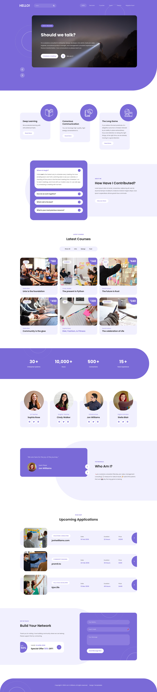

# Hello! Should we talk?

<div style="display:flex; align-items:flex-start;">
  <div>
    This is a quasi-realistic exercise with Fillerama in Django for jonhwilliams.com. You might notice the content seems disconnected, but edgy, irreverent, with a subtle undercurrent of poignancy. One of these weekends we might decide to put real content in there, but then we'ld have to charge you a subscription, implement modals, and assure you we respect your privacy and would *never* accidentally sell your address.
    <ul>
      <li>👀 build: python venv managed w asdf</li>
      <li>🌱 version control: github</li>
      <li>💞️ deploy: cost-effective serverless hosting</li>
    </ul>
  </div>
  
</div>


# kjon &middot; django  
 
  
 
 
  
 
I love meeting new people. To connect:  
- Mention me in an issue or pull request: @kjon-life  
- My friends connect on [Instagram: @kilo.jon](https://www.instagram.com/kilo.jon/)   
- [LinkedIn](https://www.linkedin.com/in/jonhwilliams) works for everything else.


### Project Overview:
* Gunicorn is a Python WSGI HTTP Server for UNIX, perfect for serving Django projects in production
* Postgres
* WhiteNoise to serve static files
* Authenticate with 2FA
* GitHub Actions deploys main to dev automatically

### Tech stack:
* [requirements](https://github.com/kjon-life/kjon_django/blob/main/requirements.txt)
  * django-environ - separate local,dev,prod (in practice had to use environment variables to avoid commiting things to github which should not be there)
* Postgres
* Docker - to package Django apps as image (this is a fly.io thing)
* flyctl - to build images, config toml, and deploy
* GitHub Actions - for CI/CD (just because you can)
* Fly.io - for the serverless hosting platform (turns off for the 99.99999 percent of the time that no one is visiting the site)

```flyctl``` is a CLI tool from [Fly.io](http://fly.io)
You can read about it [here](https://fly.io/docs/hands-on/).

### History:  
#### Serverless hosted Django w Postgres
> 2024-04-07 2231  HRS 
* App deployed on fly.io and available at [https://kjon-django.fly.dev/](https://kjon-django.fly.dev/) or [https://django.jonhwilliams.com/](https://django.jonhwilliams.com/)  
* GitHub [repository](https://github.com/kjon-life/kjon_django) is now public. 
```bash
fly secrets set CSRF_TRUSTED_ORIGINS='https://kjon-django.fly.dev'
fly secrets set ALLOWED_HOSTS='kjon-django.fly.dev'
```

#### Local Django
* Postgres
* Using a templatemo-scholar template


### Acknowledgements:

This project [depends](https://github.com/kjon-life/kjon-life/network/dependencies) on the copious contributions of others and is possible because of the following services:

- [Porkbun](https://porkbun.com/) - Domain registration and DNS management
- [Fly.io](https://fly.io/) - Application hosting platform
